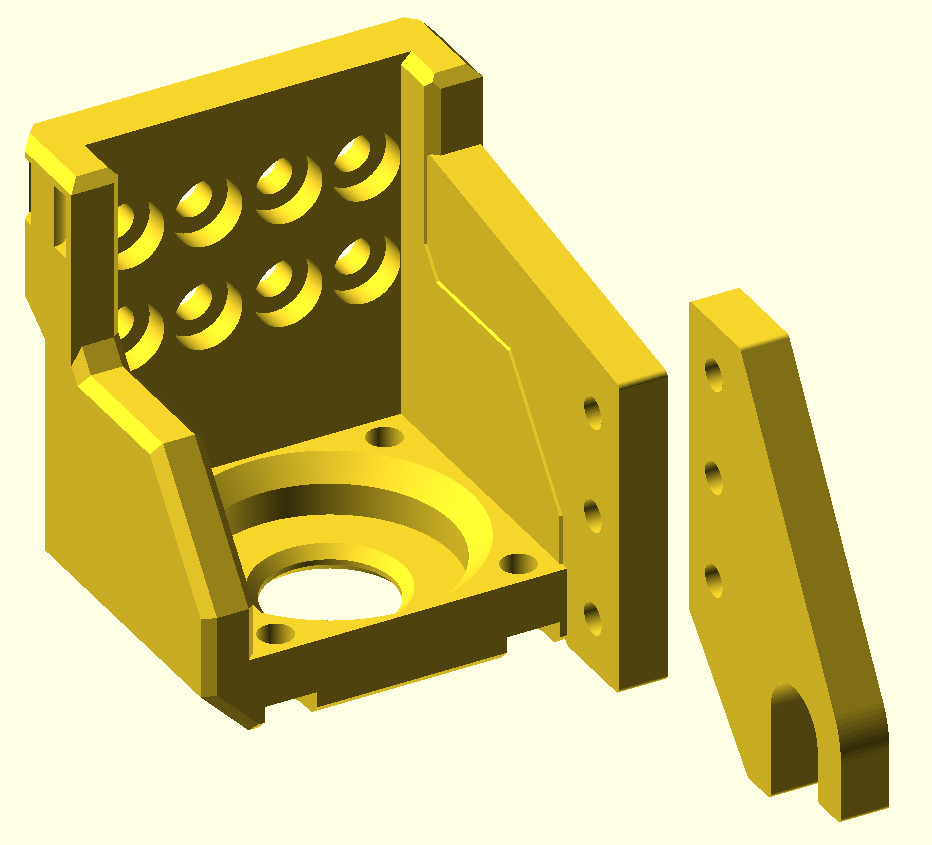

# Lumenpnp Gantry with actuator for PushPull Feeder

This model is for use with a PushPull feeder on an Opulo lumenpnp machine.

This model includes a copy of the [lumenpnp](https://github.com/opulo-inc/lumenpnp)
original Z gantry, for the purpose of adding a mounting bracket.

The PushPull feeder is actuated by pushing and pulling on a lever with 8mm diameter
handle. This model contains an actuator hook corresponding to that handle. The two parts
should be connected with 3x M3 bolts.

This works with Mark's original [PushPullFeeder](https://github.com/markmaker/PushPullFeeder)
and [this fork](https://github.com/tobydickenson/PushPullFeeder) with some changes for
use on the lumenpnp machine.

STL files for immediate printing are in the 'printme' directory.

