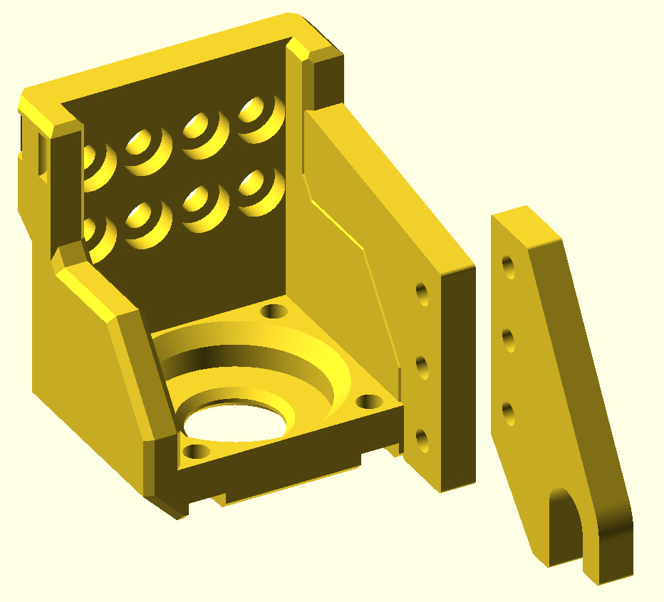

# Lumenpnp Gantry with actuator for PushPull Feeder

The PushPull feeder is actuated by pushing and pulling on a lever with 8mm diameter
handle. This model contains two parts, to be connected by three M3 bolts:
- a modification to the standard lumenpnp left z gantry to add a mounting bracket.
- an actuator hook to mount on that bracket.

